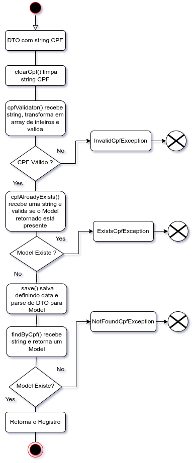

# api-restricted-list


API Restricted List foi criada em resolução a um desafio técnico, nela utilizei a stack Java na versão 17 com framework Spring, alguns detalhes sobre o framework:

- Spring data JPA para o mapeamento de entidades e persistência de dados.
- Spring MVC utilizando dos padrões de anotações para as divisões de contextos Model-View-Controller.
- Spring Core como controlador de injeções de dependências.
- Spring Boot como gerenciador de dependências do projeto `versão 3.0.2`.

##### Configurações 
Estas são as dependências que utilizei até o momento, no arquivo `pom.xml` encontramos `spring-boot-starter-data-jpa` - `spring-boot-starter-validation` - `spring-boot-starter-web` - `spring-boot-devtools` - `h2` - `lombok` - `spring-boot-starter-test`.Utilizei o H2 por ser uma base de dados local que facilitaria os testes e a execução da aplicação em outros ambientes.

Para a transferência e modificações de estado de objetos utilizo o padrão DTO, que fornece a ideia de um objeto genérico que é moldado e validado, antes do parse para um model e o salvamento na base de dados. Utilizo alguns padrões de Clean Code para nomenclatura de classes e funções, tentando sempre evitar números mágicos e mantendo funções com um escopo único assim diminuindo o acoplamento.

##### Sobre a API
A API dispõe apenas de uma entidade `TrackedUserModel` sem relacionamentos, que requer uma `String: cpf` e uma `LocalDateTime` que é definida no método `save()` após a limpeza da string por `clearCpf()`, validação dos dígitos verificadores pelo cálculo de módulo 11 na função `cpfValidator()` e validação da existência ou não de um registro para este cpf fornecido na função `cpfAlreadyExists`. Também foi criado um pacote de *Constants* que possui as constantes de exceptions, junto a um array de string que serve para validar CPFs que são válidos para o cálculo de módulo 11 porém inválidos legalmente, como exemplo `111.111.111-11`.

O tratamento de exeptions foi criado com o perfil `@BeanValidation`, as classes de exception extendem `RunTimeException` e uma classe padrão de erro foi criada `StandardError`. Na classe com o perfil `@ExceptionHandler` a *Standard* serve como tipagem para as funções que chamam minhas exceções. 

## Docker
O arquivo `Dockerfile` se encontra da seguinte forma: 


```docker
FROM maven:3.8.7-openjdk-18 as build
WORKDIR /build
COPY . .
RUN mvn clean package

FROM openjdk:18
WORKDIR /app
COPY --from=build ./build/target/*.jar ./application.jar
EXPOSE 8080

ENTRYPOINT java -jar application.jar
```
Podemos observar que o arquivo está em estágios e não necessitamos efetuar o *build* sempre, apenas geramos um nova imagem e um contêiner como orientado a seguir:
> Tente a execução pelo Docker Labs - Esta imagem esta no meu DockerHub 

[Docker Labs](https://labs.play-with-docker.com/)

 Gerar Contêiner
```sh
docker run --name ${nome container} -p 8081:8080 matheusnicolau/api-restricted-list
```
```
```
Ou então tente assim: 
>   `É necessário a instação do Docker antes das configurações`

 Gerar Imagem 
 ```sh
docker build -t matheusnicolau/api-restricted-list .
```
 Gerar Contêiner
```sh
docker run --name api-restricted-list -p 8080:8080 matheusnicolau/api-restricted-list
```
Para inicializar a aplicação no container já criado
```sh
docker start ${nome do container}
```
Para finalizar um contêiner
```sh
 docker stop ${nome do container}
```
Para listagem de contêiner
```sh
 docker ps
```
##### Diagrama




## Links do Projeto

Abaixo plataformas onde estão hospedados alguns links do projeto.

| Plataform | Link |
| ------ | ------ |
| DockerHub | https://hub.docker.com/repositories/matheusnicolau |
| GitHub | https://github.com/matheus-nicolau/api-restricted-list |
